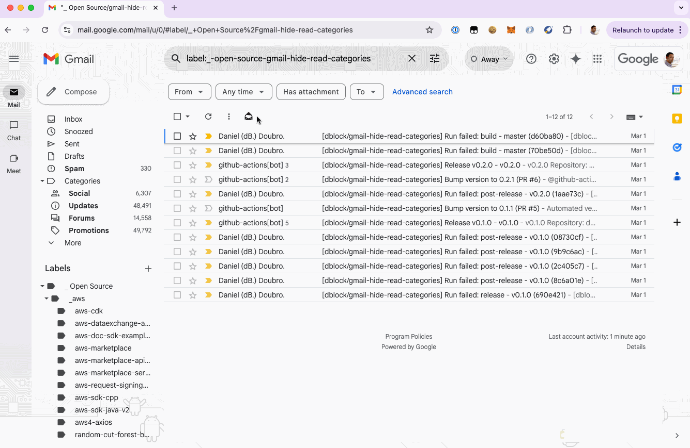

## Hide Read Categories in GMail

A GMail Chrome extension that hides categories without unread messages.

Built on top of [gmail.js](https://github.com/KartikTalwar/gmail.js) and its [boilerplate](https://github.com/josteink/gmailjs-node-boilerplate).

### Contributing

You're encouraged to contribute to this project. See [CONTRIBUTING](CONTRIBUTING.md) for details.

### Copyright and License

Copyright (c) Daniel Doubrovkine and Contributors.

This project is licensed under the MIT License.
